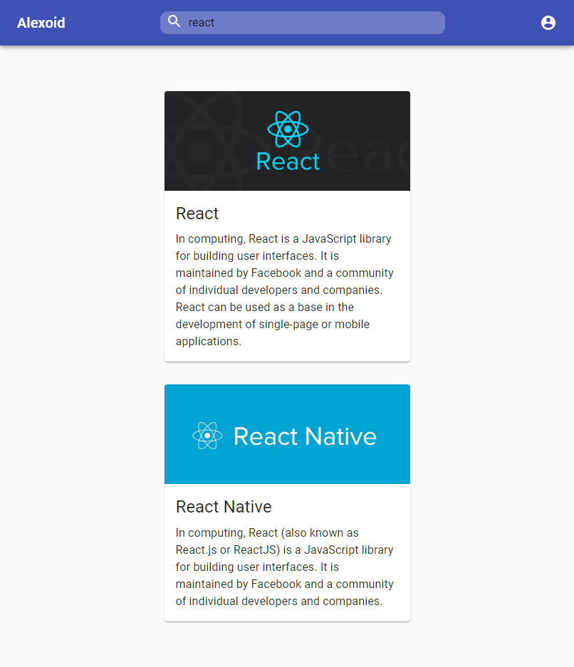

# Tech Info
## Tech-Info using react and redux

Additional description about the project and its features.

## Built With

- HTML,
- Bootstrap
- React
- Redux
- Node (Node Module to store Data)
## Live Demo

[Live Demo Link](https://alexoid1.github.io/Tech-Info/#/results)

## Getting Started

**Navigation bar**
- Go to (https://alexoid1.github.io/Tech-Info/#/results/) and have a look around. 

**Terminal**
- cd into the repo folder. 
- npm start

In this project:
- Using a Node Module to store Provisional Data
- Diferent react component for every element on the app.
- Redux manage every Event Action on the project.
- Bootstrap.

To get a local copy  and to set it up and running follow these simple example steps.

### Prerequisites

- Browser
- Internet
- Download the code from repository (https://github.com/Alexoid1/Tech-Info)

## Author

👤 **Pablo Alexis Zambrano Coral**

- Github: [@Alexoid1](https://github.com/Alexoid1)
- Twitter: [@pablo_acz](https://twitter.com/pablo_acz)
- Linkedin: [linkedin](https://www.linkedin.com/in/pablo-alexis-zambrano-coral-7a614a189/)

## Show your support

Give a ⭐️ if you like this project!

## Acknowledgments

- Hat tip to anyone whose code was used
- Inspiration
- etc

## 📝 License

This project is [MIT](LICENSE) licensed.#
